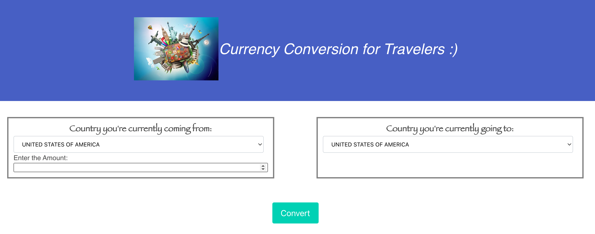
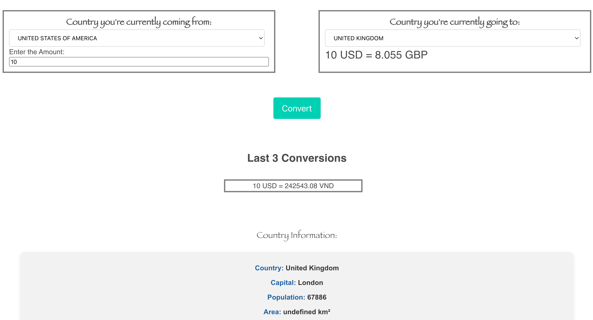

# Currency Conversion For Travelers 

## Overview
The Currency Converter App is a user-friendly tool designed for travelers seeking a quick and reliable way to convert their money into different currencies. The application simplifies the process of understanding expenditures in foreign countries by providing accurate, real-time currency conversion.

## Features
- **Easy Selection of Currencies**: Users can easily select their home country and the country they are visiting to set the currencies for conversion.
- **Quick Conversion**: With a simple click of the "Convert" button, users get instant and accurate conversion of their entered amount.
- **Recent Conversion History**: The app displays a table of the most recent three conversions from loca storage, allowing users to track their latest transactions conveniently.
- **Real-Time Exchange Rates**: Utilizing up-to-date exchange rate information to ensure accurate conversions.

## User Story
As a frequent traveler, I want an easy-to-use currency converter application, so that I can quickly understand how much I'm spending in my home currency when I'm abroad.

## How to Use

Link to live Site: https://rosiedeng1.github.io/TravelAssistanceApplication/

Instructions for ![CurrencyConverterApplication]: This shows the website and it's format 

1. **Open the App**: Start by launching the currency converter application.
2. **Select Currencies**: Choose your home country's currency and the currency of the country you are visiting.
3. **Enter Amount**: Input the amount of money you wish to convert.
4. **Convert**: Click on the “Convert” button to get the converted amount.
5. **View Recent Conversions**: The application displays the most recent three conversions in a dedicated table.

## Technologies Used
- HTML, CSS for front-end design. We used Bulma as our CSS framework!
- JavaScript for functionality and API integration.
- Real-time currency exchange rate API.
- Country facts API.

=Breakdown of roles: HTML, CSS, part of local storage- Rosie (Rong Si) Deng 
Local Storage and presentation slides: Yuval Nahmias 
Currency Converter API (Javascript): Estephany Tan 
Country Fact API (Javascript): Tarun Para

## Challenges and Solutions
- **Challenge**: Ensuring real-time accuracy of currency exchange rates.
- **Solution**: Integration of a reliable currency exchange rate API that updates rates regularly.

## Successes
- Accurate and instant currency conversion.
- User-friendly interface suitable for all user levels.
- Incorporation of real-time data for up-to-date information.
- Efficient tracking of recent conversions, enhancing user experience.

## Directions for Future Development
- **Adding More Currencies**: Expanding the list of available currencies for conversion.
- **Offline Mode**: Developing an offline mode that uses the last updated rates for conversion.
- **Conversion Trends**: Implementing a feature to view historical conversion trends.

## Conclusion
The Currency Converter App stands out as an essential tool for travelers, offering an intuitive and reliable solution for managing financial transactions abroad. Its incorporation of real-time data and user-centric features makes it a valuable companion for both seasoned and novice travelers. With future enhancements, the app is poised to become even more versatile, further simplifying the international travel experience.

## License

Please refer to the LICENSE in the repo.